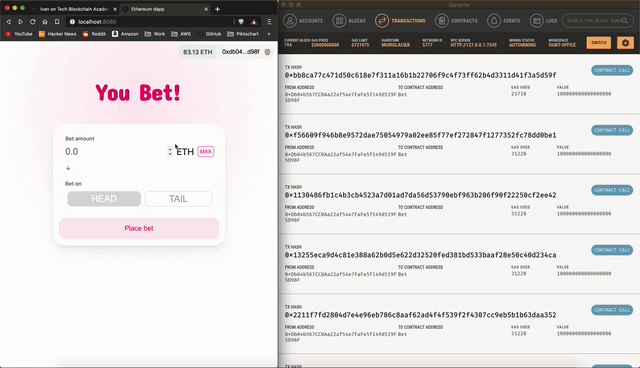

# B-Bet smart contract study project

This is my take on
[Ethereum Smart Contract Programming 201](https://academy.ivanontech.com/products/ethereum-smart-contract-programming-201)
assignment of creating a smart contract and dapp to bet on a coin flip.



This project also contains a (naive) oracle implemented in node to provide random
numbers to the blockchain.

## Local setup

Install dependencies using `yarn install` in the project's root. `npm install`
should work the same.

### Contract setup

1. Have [Ganache](https://www.trufflesuite.com/ganache) up an running
2. Run `yarn migrate --reset` to deploy the contract on the local Ganache network

### Wallet setup

1. Install [Metamask](https://metamask.io/) or enable Brave wallet
2. In the wallet network selection use "Custom RPC" to add a new network,
   name it "Ganache" and copy the RPC network address from Ganache interface
   (usually `http://127.0.0.1:7545`)
3. In the wallet accounts, select "import account" and use one of the Ganache
   generated private address

### Oracle setup

1. From Ganache get the private key of the account with index 3
   (:warning: only use local, test only key that you can expose)
2. From Ganache get the Oracle deployed contract address
3. Run the oracle with
   ```
   node oracle.js -a <private_key_index_3> -c <oracle_contract_address>
   ```
4. The oracle should now be listening to the blockchain, use `ctrl-C` twice to
   quit

### Dapp setup

1. Run `yarn dev` to start the dapp local server
2. Navigate to [`http://localhost:8080/`](http://localhost:8080/) and you should
   see the dapp

## Dapp usage

1. Click the "Connect to Wallet" button at the top right, you should be presented
   with Metamask connection interface; accept the connection
2. Add a sum to bet in the input field
3. Click on "Place bet"
